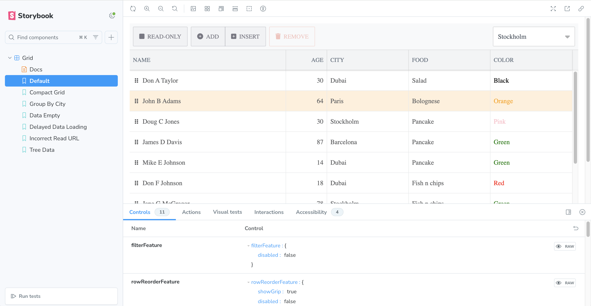

# Creating a Bryntum Grid React component and integrating it with Storybook starter

This starter project was generated using the [Vite with TypeScript and React](https://vite.dev/guide/#scaffolding-your-first-vite-project) starter template.

## Getting started

Install the dependencies by running the following command: 

```sh
npm install
```

## Installing the Bryntum React Grid component

First, install the Bryntum Grid component by following the instructions to [access the Bryntum npm registry](https://bryntum.com/products/grid/docs/guide/Grid/quick-start/javascript-npm#access-to-npm-registry), and then [install the Grid and React Grid wrapper](https://bryntum.com/products/grid/docs/guide/Grid/quick-start/react#install-bryntum-grid-packages).

## Running the app

Use the following command to run the local dev server:

```sh
npm run dev
```

Open `http://localhost:5173`. You'll see a Bryntum Grid.

## Running the Storybook workshop

Use the following command to run the Storybook workshop:

```sh
npm run storybook
```

Open `http://localhost:6006`, you'll see a Storybook workshop with various stories for a Bryntum Grid component:

